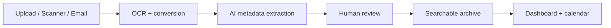
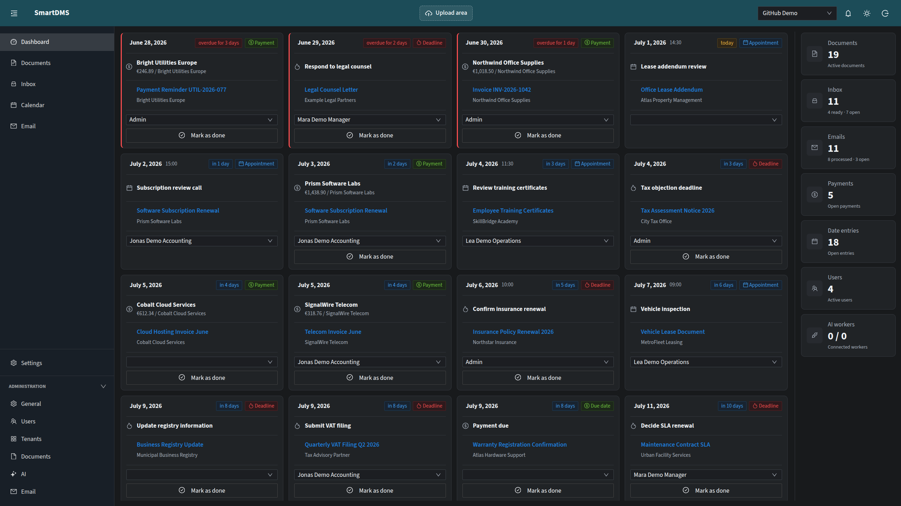
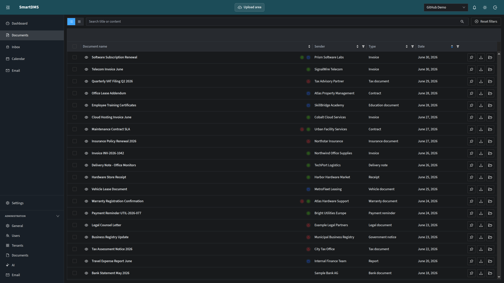
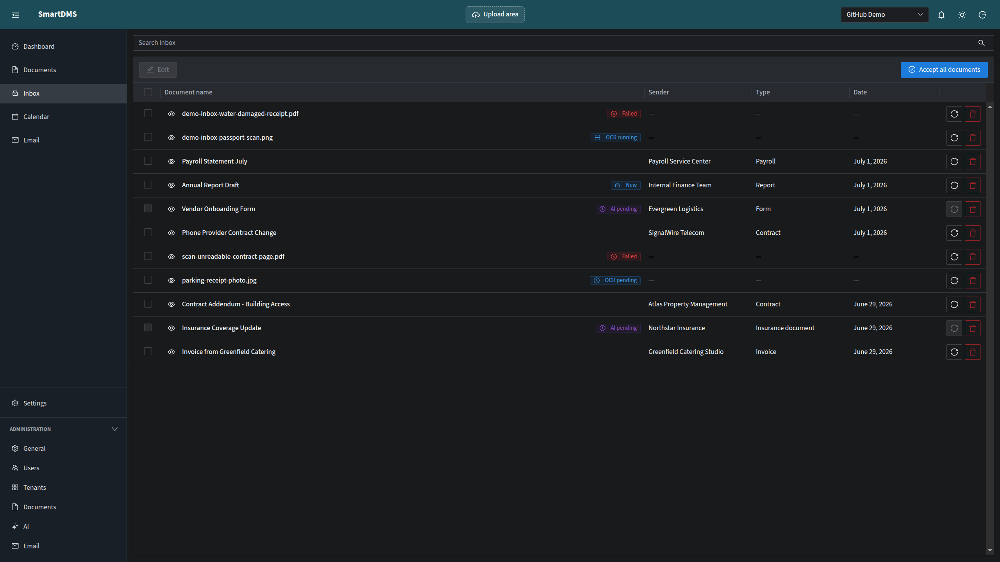
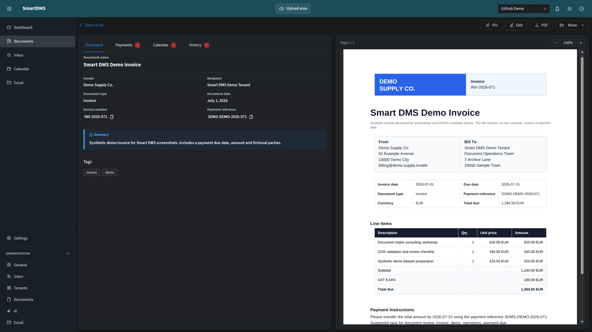
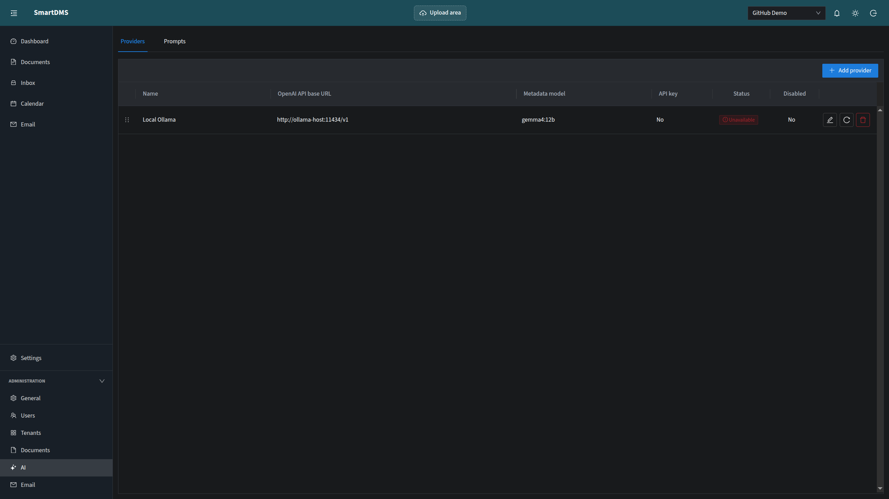
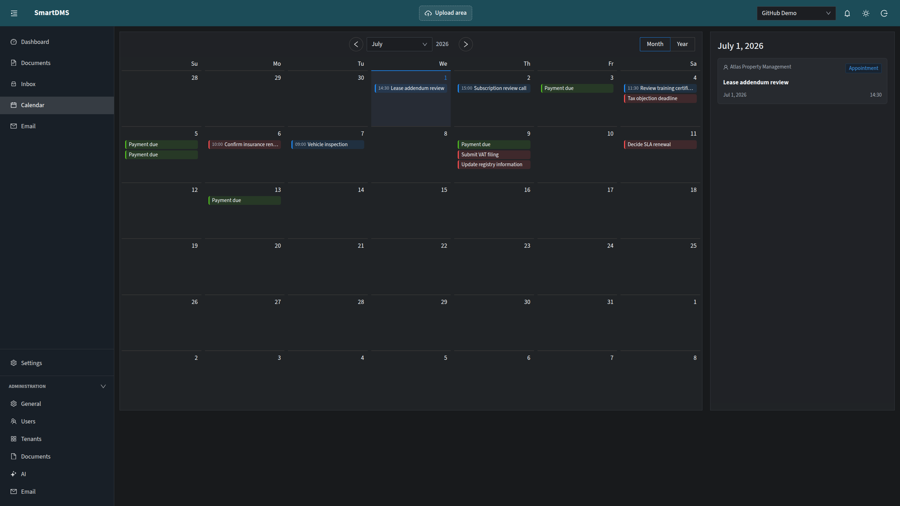
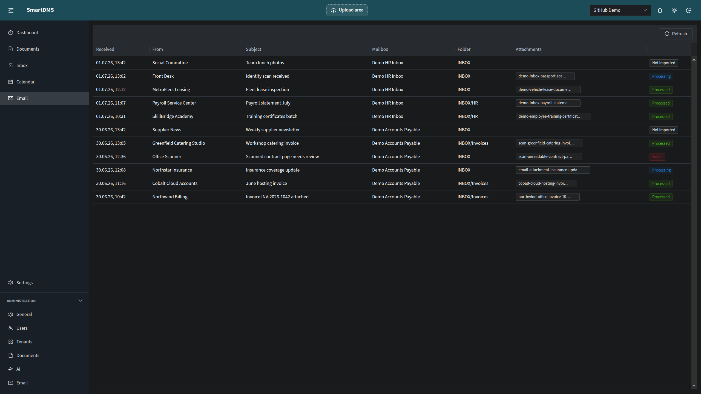

# Smart DMS

<p align="center">
  <strong>Self-hosted, local-first document management for private paperwork.</strong>
</p>

<p align="center">
  Upload, scan, OCR, review and archive important documents - with searchable PDFs and AI-assisted metadata.
</p>

<p align="center">
  <a href="#quick-start">Quick start</a> ·
  <a href="#features">Features</a> ·
  <a href="#screenshots">Screenshots</a> ·
  <a href="#deployment">Deployment</a> ·
  <a href="#local-development">Development</a> ·
  <a href="#configuration-and-docs">Docs</a>
</p>

<p align="center">
  
  
  
  
</p>

---

## What is Smart DMS?

Smart DMS is a self-hosted document management system for individuals, households and people who manage private documents together. It turns browser uploads, scanner folders and PDF email attachments into one review inbox, creates searchable documents, suggests metadata with AI and keeps a human review step before anything becomes part of the archive.

It is built for the everyday paper trail that otherwise ends up in binders, inboxes and scattered folders: letters, invoices, insurance documents, contracts, tax paperwork and other important records.

## Why use Smart DMS?

| Benefit                         | What it means in practice                                                                                                    |
| ------------------------------- | ---------------------------------------------------------------------------------------------------------------------------- |
| **One intake workflow**         | Upload documents in the browser, import scanner output from folders or pull PDF attachments from configured IMAP mailboxes.  |
| **Searchable archive**          | OCR, previews, full-text search, filters, tags and document types help you find documents again.                             |
| **AI-assisted metadata**        | Extract proposed titles, summaries, parties, tags, payments, deadlines and calendar events from OCR and Markdown text.       |
| **Review before archive**       | Correct metadata, lock fields, reprocess documents and accept only what you have reviewed.                                   |
| **Dashboard and calendar**      | Surface payments, due dates, deadlines and appointments from your documents.                                                 |
| **Local-first infrastructure**  | Run the web UI, API, processor, PostgreSQL, Redis, storage, OCR runtime and Docling runtime with Docker Compose.             |
| **Flexible AI setup**           | Use configurable OpenAI-compatible providers, including local endpoints such as Ollama or LM Studio, or external model APIs. |
| **Multi-user and multi-tenant** | Create users and tenants, manage memberships and keep document workflows separated.                                          |

## How it works



1. **Import** documents through the browser, scanner import folders or email ingestion.
2. **Process** them with OCR and document conversion to create searchable PDFs, previews, OCR text and Markdown.
3. **Extract** suggested metadata with an OpenAI-compatible AI provider.
4. **Review** titles, summaries, tags, parties, payments, deadlines and calendar events.
5. **Archive** accepted documents and find them later through search, filters, tags and document types.

## Features

| Area                   | Capabilities                                                                                          |
| ---------------------- | ----------------------------------------------------------------------------------------------------- |
| Document intake        | Browser uploads, scanner import directories and PDF attachment import from configured IMAP mailboxes. |
| OCR and conversion     | Compose-managed OCR and Docling runtimes create searchable PDFs, previews, OCR text and Markdown.     |
| AI extraction          | Proposed titles, summaries, document types, parties, tags, payments, deadlines and calendar events.   |
| Review workflow        | Review, correct, lock, reprocess and accept documents before final archiving.                         |
| Search and retrieval   | Full-text search, filters, document types, tags, downloads and reprocessing.                          |
| Dashboard and calendar | Important payments, deadlines and appointments prepared for review and surfaced in dedicated views.   |
| Users and tenants      | Multiple users, multiple tenants, tenant memberships and separated document workflows.                |
| Deployment             | Source-based Docker Compose deployment with local builds on your Docker host.                         |

OCR is the text and search foundation. AI extraction is the intended workflow for turning OCR and Markdown text into structured document metadata, but all important metadata should still be reviewed by a user.

## Screenshots

Screenshots use synthetic demo data only.



| Document search                                                                                                      | Inbox review                                                                                                 |
| -------------------------------------------------------------------------------------------------------------------- | ------------------------------------------------------------------------------------------------------------ |
|  |  |

| Document detail                                                                                              | AI provider settings                                                                                     |
| ------------------------------------------------------------------------------------------------------------ | -------------------------------------------------------------------------------------------------------- |
|  |  |

| Calendar                                                                                                  | Email ingestion                                                                                                           |
| --------------------------------------------------------------------------------------------------------- | ------------------------------------------------------------------------------------------------------------------------- |
|  |  |

## Quick start

Most users should run Smart DMS with Docker Compose on the machine where the documents should live. This can be a Linux server, a workstation or a Windows machine using Docker Desktop with WSL2/Linux containers.

### Requirements

For Docker deployments:

- Linux server or workstation with Docker Engine and the Docker Compose plugin, or Windows with Docker Desktop in WSL2/Linux-container mode.
- Git for cloning and updating the source checkout.
- Enough disk space for PostgreSQL, Redis, document storage, OCR and Docling runtime images.
- A free host port for the web UI, default `8080`, or an existing Traefik reverse proxy.

For source development:

- Node.js with Corepack and PNPM.
- Docker and Docker Compose.
- Free local ports for the default development setup:
  - API: `3010`
  - Web: `4200`
  - PostgreSQL: `5432`
  - Redis: `6379`

### 1. Clone the repository

```bash
git clone https://github.com/bossert5/smart-dms.git
cd smart-dms
```

### 2. Create the deployment configuration

```bash
cp .env.example .env
nano .env
```

Replace at least these values in `.env`:

- `JWT_ACCESS_SECRET`
- `DMS_SECRET_ENCRYPTION_KEY`
- `SMART_DMS_POSTGRES_PASSWORD`
- `SMART_DMS_REDIS_PASSWORD`, or leave it empty intentionally

Use long random values. On Linux, one simple way to generate a secret is:

```bash
openssl rand -hex 32
```

> [!IMPORTANT]
> The helper scripts validate `.env` and stop when required values are missing or still contain placeholders. Manual `docker compose` commands require the same `.env` review first.

### 3. Start Smart DMS

```bash
scripts/start-compose.sh
```

The first build can take several minutes because Docker downloads base images, Node/Python dependencies, Tesseract language data and Docling runtime dependencies.

Open Smart DMS in your browser:

```text
http://<docker-host>:8080
```

On the same machine:

```text
http://localhost:8080
```

Initial login for a fresh database:

```text
admin / admin
```

The backend forces a password change after the first login.

## Deployment

Smart DMS is distributed as source code. The supported deployment path is to clone the repository on your Docker host and build the application containers locally with Docker Compose.

There are currently no published Docker images or binary release artifacts. Deployments and updates use the scripts in this repository, so the running containers are built from the same source code and Dockerfiles that are visible in the checkout.

### Deployment modes

| Mode                          | Use when                                                     | Start                                                | Update                                                |
| ----------------------------- | ------------------------------------------------------------ | ---------------------------------------------------- | ----------------------------------------------------- |
| Local port                    | You want Smart DMS on `http://<host>:8080`.                  | `scripts/start-compose.sh`                           | `scripts/update-compose.sh`                           |
| Traefik                       | You already run Traefik and want HTTPS/domain routing there. | `scripts/start-compose.sh --traefik`                 | `scripts/update-compose.sh --traefik`                 |
| Local port with scanner group | The scanner import folder needs a supplemental Linux group.  | `scripts/start-compose.sh --scanner-group`           | `scripts/update-compose.sh --scanner-group`           |
| Traefik with scanner group    | Traefik deployment plus group-protected scanner import.      | `scripts/start-compose.sh --traefik --scanner-group` | `scripts/update-compose.sh --traefik --scanner-group` |

The scripts validate `.env`, build local Smart DMS images and run:

```bash
docker compose up -d --build --remove-orphans
```

### Useful operations

```bash
docker compose ps
docker compose logs -f --tail=100
docker compose down
```

> [!CAUTION]
> `docker compose down` keeps data volumes. Do not use `docker compose down -v` for normal updates because it deletes persistent PostgreSQL, Redis and document storage volumes.

### Updates

From the checked-out repository on the Docker host:

```bash
scripts/update-compose.sh
```

Use the matching option for your deployment, for example:

```bash
scripts/update-compose.sh --traefik
```

## Scanner import folders

Smart DMS can import scanned files from a host directory. Set the host-side root folder with `SMART_DMS_SCANNER_IMPORT_PATH` in `.env`; the default is `./scanner-import` inside the repository checkout.

Inside that root folder, Smart DMS creates one import folder per tenant:

- The default tenant uses `default`, so the default host path is `./scanner-import/default`.
- New tenants use their tenant key as scanner import folder unless a custom scanner import path is configured for that tenant.
- When a tenant scanner import path is changed, Smart DMS creates the new folder automatically.

Point your network scanner at the tenant folder, not at the general import root. For example, if `.env` contains:

```env
SMART_DMS_SCANNER_IMPORT_PATH=/srv/smart-dms/scanner-import
```

then the default tenant folder is:

```text
/srv/smart-dms/scanner-import/default
```

Expose that folder on your network, for example with SMB/Samba or a NAS share, and configure the scanner to write PDFs or images into that share. Smart DMS does not create the SMB share itself; it only watches the mounted host directory.

The API container must be able to read, move and delete files from the import folder. If the folder is protected by a Linux group, use the `--scanner-group` deployment mode and set `SMART_DMS_SCANNER_IMPORT_GID`.

## Traefik deployment

Use this path when you already run Traefik on the Docker host and want Smart DMS to be reachable through a domain with Traefik-managed routing.

First complete the quick-start steps through `.env` creation. Then set the Traefik values in `.env`:

```env
SMART_DMS_TRAEFIK_HOST=dms.your-domain.example
SMART_DMS_TRAEFIK_ENTRYPOINT=websecure
SMART_DMS_TRAEFIK_CERTRESOLVER=letsencrypt
SMART_DMS_TRAEFIK_NETWORK=proxy
```

Start Smart DMS behind Traefik:

```bash
scripts/start-compose.sh --traefik
```

Update it later with:

```bash
scripts/update-compose.sh --traefik
```

The Traefik modes do not publish the web port directly. Traffic is routed through Traefik to the `web` service. The helper script creates the configured external Docker network if it does not already exist.

Manual Compose commands and all configuration variables are documented in [`docs/docker-compose-deployment/`](docs/docker-compose-deployment/).

## Windows and WSL

Docker Compose can run Smart DMS on Windows through Docker Desktop when Linux containers and WSL2 integration are enabled. The helper script is a Bash script for Linux, WSL or Git Bash. On PowerShell, use Docker Compose directly.

PowerShell startup:

```powershell
docker compose up -d --build --remove-orphans
```

PowerShell startup behind Traefik:

```powershell
docker compose -f docker-compose.traefik.yml up -d --build --remove-orphans
```

PowerShell update:

```powershell
git pull --ff-only
docker compose up -d --build --remove-orphans
```

PowerShell update behind Traefik:

```powershell
git pull --ff-only
docker compose -f docker-compose.traefik.yml up -d --build --remove-orphans
```

For source builds and scanner-import permissions, checking out the repository inside WSL is usually closer to the Linux server deployment path than building from a Windows filesystem path.

The same `docker compose ps`, `docker compose logs -f --tail=100` and `docker compose down` commands work from PowerShell.

## Local development

Prepare the local development environment:

```bash
pnpm run dev:setup
```

This command prepares the services and generated artifacts needed for local development. It creates `apps/backend/.env` from `apps/backend/.env.example` when it is missing, starts the local PostgreSQL and Redis Docker containers, prepares the OCR and Docling runtime images, installs PNPM dependencies, builds the shared DTO package, generates the Prisma Client and runs database migrations.

Run it once after cloning the repository. Run it again after pulling changes that touch dependencies, Prisma migrations, shared DTOs, backend environment defaults, or OCR/Docling runtime Dockerfiles. It is also the first command to use when the local database or Redis containers are missing or were stopped.

Start the backend, processor and web app in separate terminals:

```bash
pnpm run dev:api
pnpm run dev:processor
pnpm run dev:web
```

Open the web app at:

```text
http://localhost:4200
```

Useful checks for source changes:

```bash
pnpm run build
pnpm run test
pnpm --filter backend test:e2e
pnpm --filter web test:e2e
```

Pull requests should run the relevant checks and note them in the PR template. The default CI workflow builds shared DTOs, backend and web, generates Prisma Client and validates both Compose files.

## Configuration and docs

| Topic                             | Location                                                                                                                                                                       |
| --------------------------------- | ------------------------------------------------------------------------------------------------------------------------------------------------------------------------------ |
| Docker deployment                 | [`docs/docker-compose-deployment/`](docs/docker-compose-deployment/)                                                                                                           |
| Compose configuration             | [`.env.example`](.env.example), [`.env.full.example`](.env.full.example), [`docs/docker-compose-deployment/configuration.md`](docs/docker-compose-deployment/configuration.md) |
| Development backend configuration | [`apps/backend/.env.example`](apps/backend/.env.example)                                                                                                                       |
| Contribution guide                | [`CONTRIBUTING.md`](CONTRIBUTING.md)                                                                                                                                           |
| Security policy                   | [`SECURITY.md`](SECURITY.md)                                                                                                                                                   |
| Changelog                         | [`CHANGELOG.md`](CHANGELOG.md)                                                                                                                                                 |
| Project notice                    | [`NOTICE`](NOTICE)                                                                                                                                                             |
| Third-party notices               | [`THIRD_PARTY_NOTICES.md`](THIRD_PARTY_NOTICES.md)                                                                                                                             |

## Security and reliability notes

Uploaded documents, OCR output, AI responses, email content, metadata and user input are treated as untrusted data. Do not expose Smart DMS without reviewing deployment configuration, secrets, storage paths, backups and network access.

OCR results and AI-extracted metadata can be incomplete or wrong. Users remain responsible for reviewing important data, keeping backups, testing restores and validating the system before relying on it for important documents.

## License

Smart DMS is licensed under the **GNU Affero General Public License v3.0 only**. See [`LICENSE`](LICENSE) and [`NOTICE`](NOTICE).

Copyright (C) 2026 Pascal Bossert.
